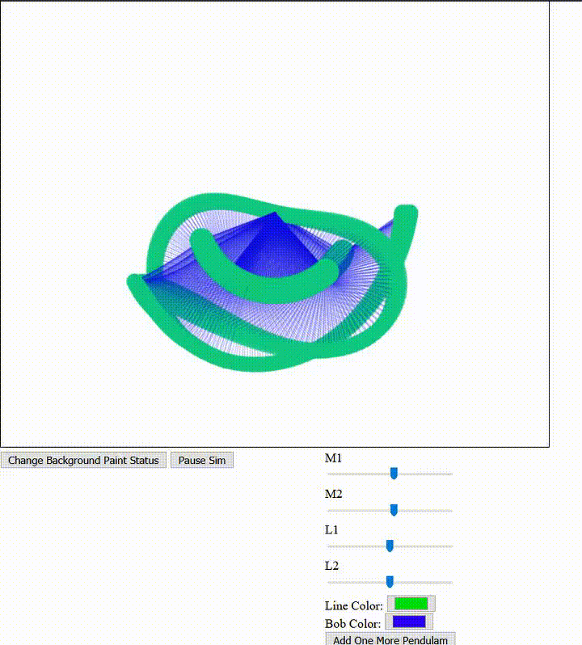

# Double Pendulam Visualization

## Visualizing double pendulam motion using wasm and rust.

# Dependencies

- [Double Pendulam](https://github.com/srirajshukla/double-pendulam-calc-rust)
- wasm-pack
- node.js

# Building
Download  the [Double Pendulam](https://github.com/srirajshukla/double-pendulam-calc-rust). In `Cargo.toml` file, in dependencies section, edit the path of `double-pendulum` to the downloaded relative location of the library. 

Next, make sure that you have installed `wasm-pack`, if not, you can install it using 
`cargo install wasm-pack`.

Next, build the `dp-vis` library using 
`wasm-pack build`.

Make sure that you've [Node.js](https://nodejs.org/en/) installed, if not install it. 

Now, cd into `/www/` directory and run
`npm run start` command, and voila! You're done!

# Examples
